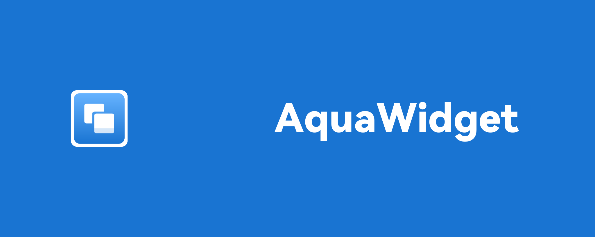

# **AquaWidget**
------------
### A personal assistant right by your side.
------
ℹ️**Introduction**

AquaWidget is a collection of card-style applications that play an assitant role in your daily life.

📲**Applications**

1. 🌧Weather - Catch up with in-time weather forecast in your city.

2. ✅Todo - Keep track of your daily tasks and schedule.Now works with [Dida365](https://dida365.com/). For the future, we will support [Microsoft To Do](https://to-do.office.com/tasks/) and [Todoist](https://www.todoist.com/).

------
*For Future Development*

3. 🎵Music - Check  and control the current playing music on your computer. Powered by [MusicNPCard](https://github.com/horace111/MusicNP_Card), which is not completed yet.

4. 📂Localsend - Send files to any devices, any operation systems. Powered by [Localsend](https://localsend.org/)([Opensource Page](https://github.com/localsend/localsend))

🔮**AI**

AI is deeply integrated into AquaWidget. The first two usages are *Today* and *Dialogues*.*Today* gives you an overview of your todo, weather and more infomation at the beginning of a day, so that you can easily manage your day.*Dialogues* ables you to communicate with AI directly. Now works with [Deepseek](https://www.deepseek.com/).

➿**More**

‼️For the server side, which is mainly written by MnlSmile, please refer to [AquaWidget-Server](https://github.com/MnlSmile/AquaWidget-Server).

This Project is made by [MnlSmile](https://github.com/MnlSmile) and [horace111](https://github.com/horace111). ⚠️And the latter is new to such projects(with PyQt5), so if there's any problems, please create an issue to let us know, and don't learn from it. (Added MnlSmile: Look at my Result Oriented Programming then.)

⬇️**Installation**

Download from the Release Page.